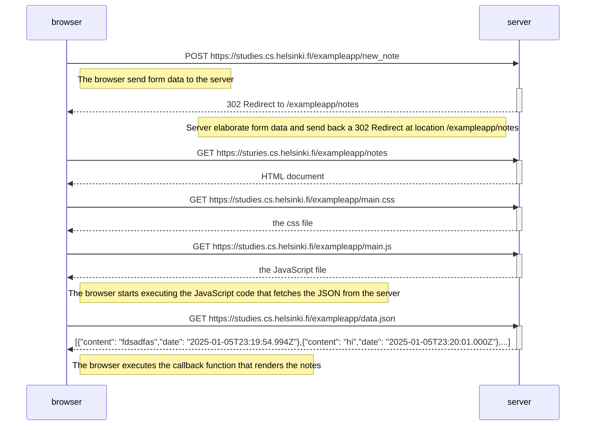

```mermaid
sequenceDiagram
    participant browser
    participant server

    browser->>server: POST https://studies.cs.helsinki.fi/exampleapp/new_note
    Note right of browser: The browser send form data to the server
    activate server
    server-->>browser: 302 Redirect to /exampleapp/notes
    deactivate server

    Note left of server: Server elaborate form data and send back a 302 Redirect at location /exampleapp/notes

    browser->>server: GET https://sturies.cs.helsinki.fi/exampleapp/notes
    activate server
    server-->>browser: HTML document
    deactivate server

    browser->>server: GET https://studies.cs.helsinki.fi/exampleapp/main.css
    activate server
    server-->>browser: the css file
    deactivate server

    browser->>server: GET https://studies.cs.helsinki.fi/exampleapp/main.js
    activate server
    server-->>browser: the JavaScript file
    deactivate server

    Note right of browser: The browser starts executing the JavaScript code that fetches the JSON from the server

    browser->>server: GET https://studies.cs.helsinki.fi/exampleapp/data.json
    activate server
    server-->>browser: [{"content": "fdsadfas","date": "2025-01-05T23:19:54.994Z"},{"content": "hi","date": "2025-01-05T23:20:01.000Z"},...]
    deactivate server

    Note right of browser: The browser executes the callback function that renders the notes
```