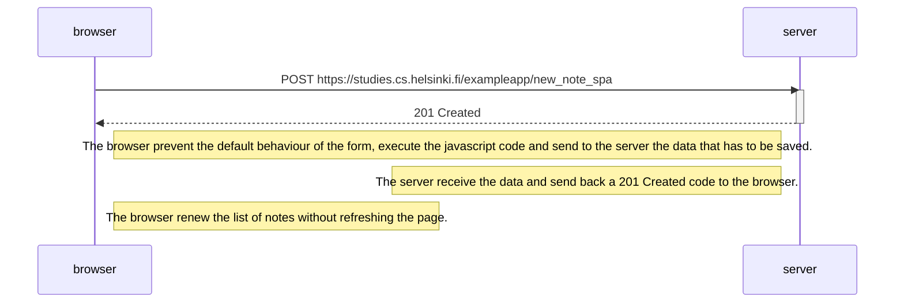

```mermaid
sequenceDiagram
    participant browser
    participant server

    browser->>server: POST https://studies.cs.helsinki.fi/exampleapp/new_note_spa
    activate server
    server-->>browser: 201 Created
    deactivate server

    Note right of browser: The browser prevent the default behaviour of the form, execute the javascript code and send to the server the data that has to be saved.

    Note left of server: The server receive the data and send back a 201 Created code to the browser.

    Note right of browser: The browser renew the list of notes without refreshing the page.

```